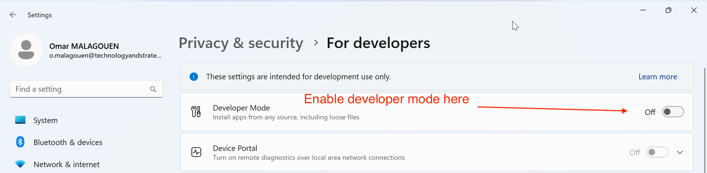
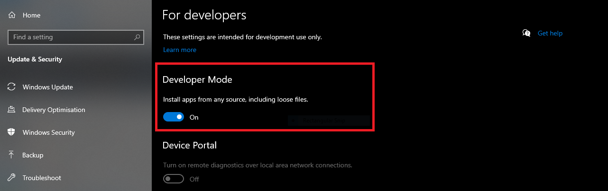
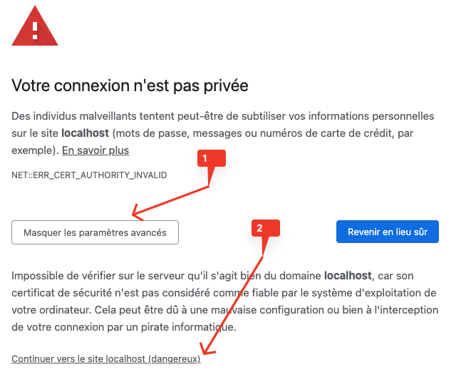

# Install tools on Windows

> First of all, remove all previous installation of Node JS and Angular.

## Install NVM

Installer nvm dans C:\nvm\

https://github.com/coreybutler/nvm-windows/releases/download/1.1.10/nvm-setup.exe

## Install Node@16 using nvm

The bellow command will install NodeJS (If nvm is not installed in c:\ just adapt the command line): 

```
C:\nvm\nvm install 22.11.0
C:\nvm\nvm use 22.11.0
```

## Install Angular CLI

Add "C:\Program Files\nodejs" to your PATH and run the command :

```
npm install -g @angular/cli@18.0.0
```

## Update windows environment variable (Windows only)

You can in case of issue regarding the ng or npm command, add the corresponding folder to the env path.  Follow the bellow step to add the folder to the path :

```
Open Powershell in Administrator mode
```

Copy paste the bellow function in the Powershell :

```
function Add-Path($Path) {
    $Path = [Environment]::GetEnvironmentVariable("PATH", "Machine") + [IO.Path]::PathSeparator + $Path
    [Environment]::SetEnvironmentVariable( "Path", $Path, "Machine" )
}
```

Then run the command :
 
```
Add-Path("C:\Program Files\nodejs")
```

## Enable Windows Developer Mode

 - On Windows 11 : Settings > Search developer and activate the mode



 - On Windows 10 :



## Trust the localhost https certificate


